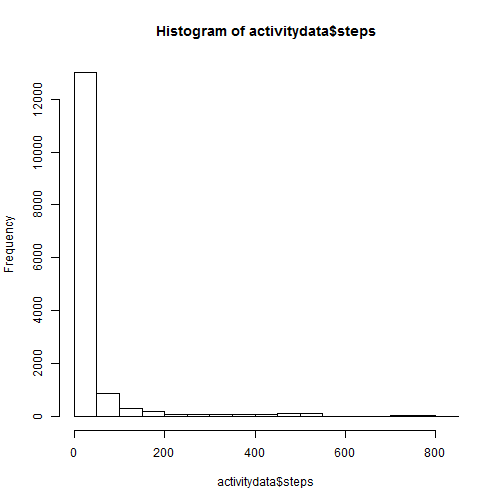
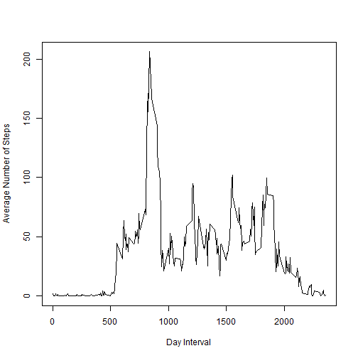
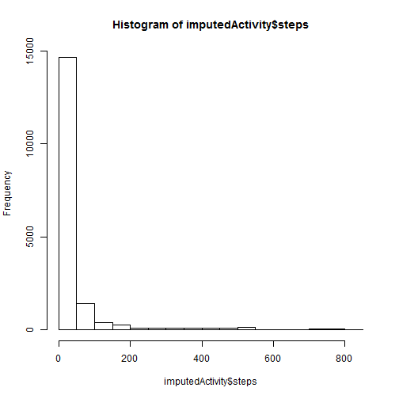

# Reproducible Research: Peer Assessment 1

## Loading and preprocessing the data
The data for this report is found inside the activity.zip archive found in this repository. The following code will extract it, if necessary, and massage the data to the correct format.

```r
if (!file.exists("activity.csv")) {
    unzip("activity.zip")
}
activitydata <- read.csv("activity.csv", stringsAsFactors = F)
activitydata$date <- as.Date(activitydata$date)
```


## What is mean total number of steps taken per day?
Ignoring `NA` values a histogram of steps per day looks as follows.

```r
hist(activitydata$steps)
```

 

```r
mean(activitydata$steps, na.rm = T)
```

```
## [1] 37.38
```

```r
median(activitydata$steps, na.rm = T)
```

```
## [1] 0
```

The mean of steps daily is 37.3826 and the median is 0


## What is the average daily activity pattern?
To view daily walking patterns it is helpful to view a plot of average steps over 5-minute intervals.


```r
aggregatedactivity <- aggregate(steps ~ interval, data = activitydata, FUN = mean)
plot(aggregatedactivity$interval, aggregatedactivity$steps, type = "l", ylab = "Average Number of Steps", 
    xlab = "Day Interval")
```

 

There is a large increase in steps per interval in the morning, with a steep decline, followed by a trailing off in the evening.


```r
indexOfMax <- which.max(aggregatedactivity$steps)
aggregatedactivity[indexOfMax, ]
```

```
##     interval steps
## 104      835 206.2
```

By looking for the row with the maximum number of steps, we can see the interval with the max number of steps is 835

## Imputing missing values
By summing the number of missing `steps` values

```r
sum(is.na(activitydata$steps))
```

We can see there are 2304 missing values.

By setting `NA` values to the mean for that interval we can impute values. Imputed data is saved in `imputedActivity`


```r
imputedActivity <- activitydata
for (i in 1:nrow(aggregatedactivity)) {
    logicalVector <- (imputedActivity$interval == aggregatedactivity[i, 1] & 
        is.na(imputedActivity$steps))
    imputedActivity[logicalVector, 1] <- aggregatedactivity[i, 2]
}
```


Using code similar to above we can make a histogram of this imputed data and calculate mean and median.


```r
hist(imputedActivity$steps)
```

 

```r
mean(imputedActivity$steps, na.rm = T)
```

```
## [1] 37.38
```

```r
median(imputedActivity$steps, na.rm = T)
```

```
## [1] 0
```


The mean and median stay the same because imputing with the mean reinforces the average. The histogram shows there are now more recorded observations.

## Are there differences in activity patterns between weekdays and weekends?
People walk less on weekends.


```r
imputedActivity$dateType <- sapply(weekdays(imputedActivity$date), FUN = function(dayName) {
    if (grepl("^S", dayName)) {
        return("weekend")
    } else {
        return("weekday")
    }
})
imputedActivity$dateType <- as.factor(imputedActivity$dateType)
aggregatedImputed <- aggregate(steps ~ interval + dateType, data = imputedActivity, 
    FUN = mean)
library(ggplot2)
```

```
## Warning: package 'ggplot2' was built under R version 2.15.3
```

```r
ggplot(aggregatedImputed, aes(x = interval, y = steps)) + geom_line() + facet_grid(dateType ~ 
    .)
```

 

